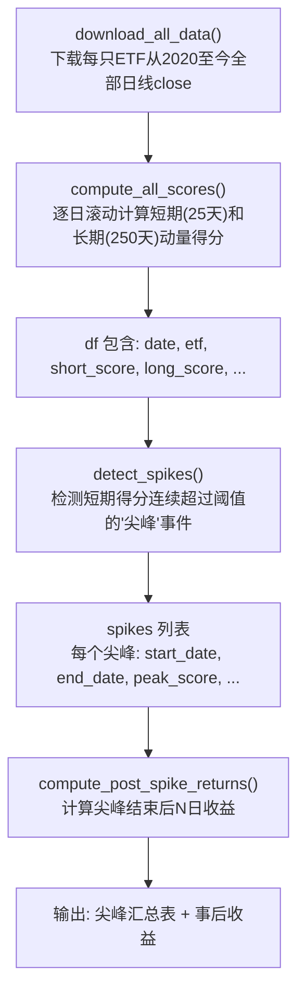
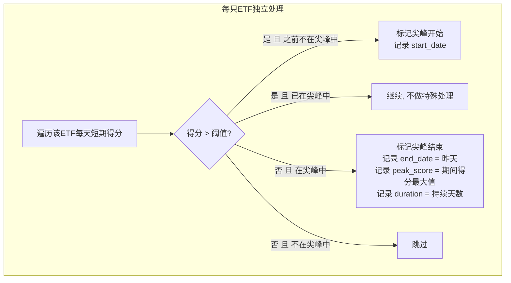
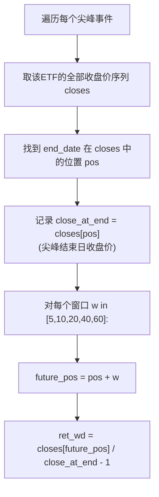
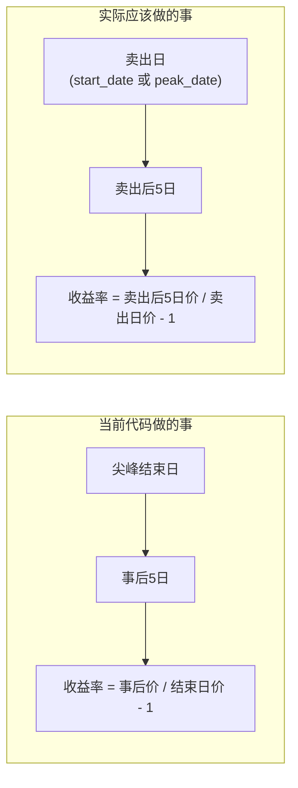
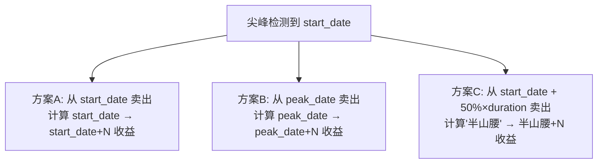

# 尖峰检测逻辑分析文档

## 1. 整体数据流



## 2. detect_spikes() 详细流程



**阈值确定逻辑**:
- 若 `SPIKE_THRESHOLD` 是数字 → 所有 ETF 共用该阈值
- 若 `SPIKE_THRESHOLD = None` → 每只 ETF 用自己的 P90/P95

## 3. compute_post_spike_returns() 详细流程



**关键公式**:
```
事后N日收益率 = (结束日后第N个交易日的收盘价) / (结束日收盘价) - 1
```

## 4. 问题所在

### 4.1 时间线图示

```
                    尖峰期间                     尖峰结束后
        |──────────────────────────────|─────────────────────────|
        |                              |                         |
     start_date                   end_date               end_date+5d
     (得分首超阈值)               (得分回落到阈值下)       (事后5d对比日)
        |                              |                         |
        |                         ① 此时卖出?                   |
        |                            (当前代码的隐含假设)         |
        |                                                       |
        |                         ② 实际上策略应该在            |
        |                            start_date 或 peak_date 卖  |
        |                                                       |
     peak_date                                                   |
     (得分峰值)                                                   |
        |                                                        |
        |  ③ 或者在这里卖?                                       |
        |                                                        |
```

### 4.2 问题本质



| 对比维度 | 当前代码 | 应该做的 |
|---------|---------|---------|
| 收益计算基准日 | `end_date`（尖峰已结束） | `start_date` 或 `peak_date`（尖峰进行中） |
| 实际可行性 | ❌ 无法预知 end_date | ✅ 可以在触发时立即卖出 |
| 回答的问题 | "尖峰消退后还会跌吗" | "尖峰触发时卖出能躲掉下跌吗" |
| 问题 | **look-ahead bias**：你只有事后才知道尖峰哪天结束 | 无偏 |

### 4.3 具体示例

以 `2022-02-10 ~ 2022-03-25 豆粕ETF 峰值11.10` 为例：

```
真实时间线:
2022-02-10  start_date  (得分首次 > P90阈值)
    |
    |  ← 策略应该在这附近考虑卖出
    |
2022-02-XX  peak_date   (得分达到最高点 11.10)
    |
    |  ← 或者在这里卖
    |
2022-03-25  end_date    (得分落回阈值下 —— 此时已经跌了32天!)
    |
    |  ← 当前代码从这里开始算收益，毫无意义
    |
2022-04-01  end_date+5d (事后5日收益 -10.33%)
```

**当前代码的 -10.33% 含义**: 从 2022-03-25 到 2022-04-01，又跌了 10.33%

**应该分析的是**: 从 2022-02-10（或 peak_date）卖出后，价格跌了多少？

## 5. 改进方向

### 5.1 应该计算的三个收益基准



### 5.2 需要修改的代码位置

| 函数 | 改动 |
|------|------|
| `detect_spikes()` | 在尖峰记录中增加 `start_close`（start_date 收盘价）和 `peak_close`（peak_date 收盘价） |
| `compute_post_spike_returns()` | 改名为 `compute_sell_returns()`，分别从 start_date、peak_date 开始计算收益 |
| `print_spike_details()` | 打印从 multiple baselines 计算的收益 |
| `plot_spikes()` | 箱线图增加方案A/B的对比 |
